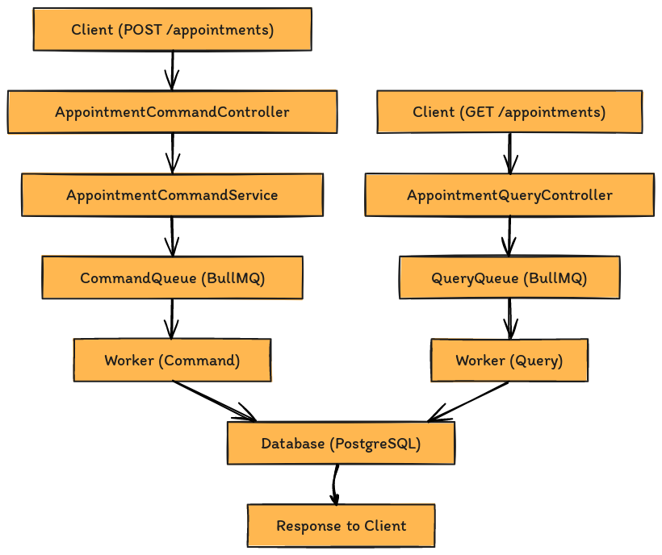

---

# CliniCare360

CliniCare360 is a comprehensive Health Clinic Management System designed to streamline the management of patient appointments, doctor schedules, and medical records. Built with React, Node.js, and PostgreSQL, this system offers secure access across different roles, including patients, doctors, and administrators.

## Features

- **User Management**: Secure login and user management for patients, doctors, and administrators.
- **Appointment Scheduling**: Efficient management of appointments, with abilities to book, update, and cancel.
- **Doctor Scheduling**: Doctors can manage their schedules and availability.
- **Medical Record Management**: Secure and private access to medical records, enabling doctors to update diagnoses and treatments.
- **Data Privacy and Protection**: Ensures that all user data is handled with the highest standard of privacy and security.

## Getting Started

These instructions will get you a copy of the project up and running on your local machine for development and testing purposes.

### Prerequisites

What you need to install the software:

```bash
npm install
```

### Installing

A step-by-step series of examples that tell you how to get a development environment running:

Start with cloning the repository on your local machine:

```bash
git clone git@github.com:coutinhomarco/ClinicCare360.git
```

To set up the frontend, run:

```bash
cd CliniCare360/client
npm install
npm start
```

To set up the backend, run:

```bash
cd CliniCare360/server
npm install
npm run dev
```

### Environment Variables

Ensure you have the necessary environment variables set up. You can create a `.env` file in the `server` directory with the following content as an example:

```env
PORT=3000
DATABASE_URL=your_database_url
JWT_SECRET=your_jwt_secret
REDIS_HOST=your_redis_host
REDIS_PORT=your_redis_port
```

## System Architecture

CliniCare360 uses a Command Query Responsibility Segregation (CQRS) architecture to separate read and write operations, enhancing performance and scalability. This approach is implemented through separate controllers and services for handling commands (create, update, delete) and queries (retrieve). BullMQ is used to manage the command and query queues efficiently.

### Backend Structure

- **Command Controllers and Services**: Handle creation, updates, and deletion of records using BullMQ for queue management.
- **Query Controllers and Services**: Handle retrieval of records ensuring fast and efficient data access using BullMQ for queue management.

### BullMQ Integration

BullMQ is integrated to handle asynchronous processing of commands and queries, improving the scalability and reliability of the system. Workers are set up to process the queues for various operations like creating, updating, and deleting records.

## Database Schema

The following diagram shows the database structure for CliniCare360:


## Request flow

The following diagram shows how the requests are handled for CliniCare360




## Built With

- [React](https://reactjs.org/) - The web framework used for the frontend.
- [Node.js](https://nodejs.org/) - The backend framework.
- [PostgreSQL](https://www.postgresql.org/) - Database system.
- [BullMQ](https://docs.bullmq.io/) - Job queue used for handling command and query processing.

## Contributing

Please read [CONTRIBUTING.md](https://github.com/coutinhomarco/ClinicCare360/CONTRIBUTING.md) for details on our code of conduct, and the process for submitting pull requests to us.

## Authors

- **Marco Soares Coutinho** - *Initial work* - [Github](https://github.com/coutinhomarco) - [LinkedIn](https://www.linkedin.com/in/coutinhomarco/)

## License

This project is licensed under the MIT License - see the [LICENSE.md](LICENSE.md) file for details

## Acknowledgments

- Hat tip to anyone whose code was used
- Inspiration
- etc

---